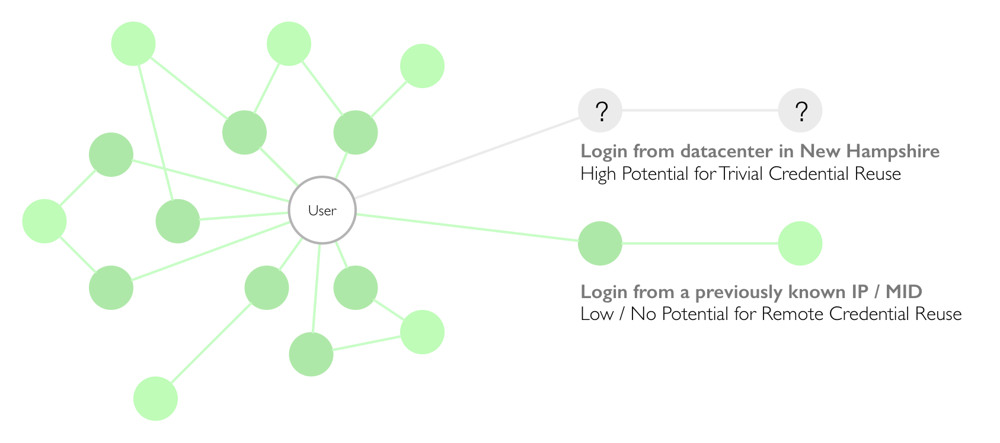
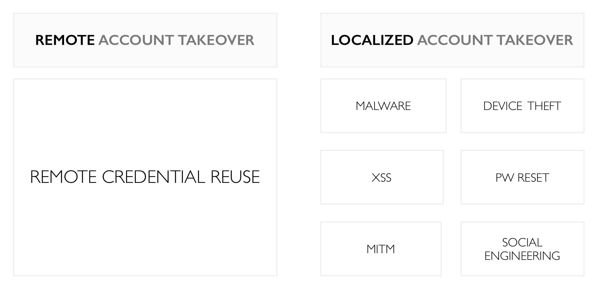
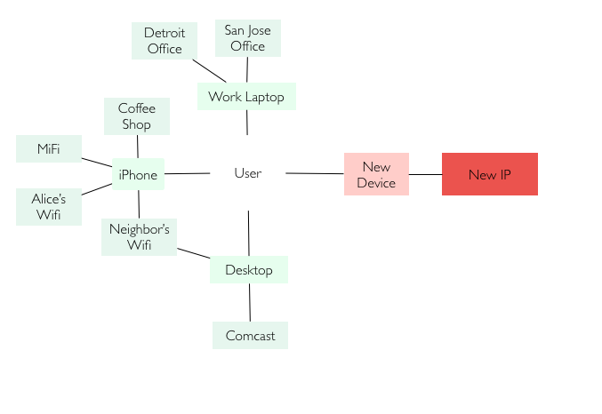

# AuthTables
[](https://travis-ci.com/magoo/AuthTables)

AuthTables is a service that detects the possibility of "Account Take Over" (ATO) caused by remote credential theft and reuse. If bad actors are stealing your users passwords, AuthTables may be useful.

After a successful authentication attempt, AuthTables can very simply respond to your app with `BAD` if it hasn't seen the user on the IP or device identifier before. You can then challenge the user with MFA, an email confirmation, or other verification. If it has seen the user, it will respond with `OK` and you have greater assurance that the user hasn't been compromised by a basic ATO (See "Threat")



AuthTables depends on no external feeds of data, risk scores, or machine learning. Your own authentication data will generate a graph of known location records for a user as they authenticate with known cookies or IP addresses. Every new login from a previously known IP or Cookie makes this graph stronger over time as it adds new record for the user, reducing their friction and increasing their security.

Read more about this strategy [here](https://medium.com/starting-up-security/preventing-account-takeover-c914fa07fb45#.pm66h84hi).

AuthTables relies on an in memory [bloom filter](https://en.wikipedia.org/wiki/Bloom_filter) allowing extremely fast responses while storing historical user location records to redis for backups and fraud investigations.

## Threat

AuthTables is solely focused on the most common credential theft and reuse vector. Specifically, this is when an attacker has a victim's username and password, but they are not on the victim's host or network. This specific threat _absolutely cannot operate_ within the known graph of users historical records, unless they are a localized account takeover threat (malware, etc)

Remote credential reuse is the most common and most accessible threat that results from large credential dumps and shared passwords.



Far more than half of the abuse issues related to ATO are remote credential reuse due to its ease of exploitation. The constellation of other problems (local malware, malicious browser extensions, MITM) usually make up the rest at most companies, and are not in scope of AuthTables.

AuthTables focuses solely on this largest problem, and logically reduces the possibility that an authentication is ATO'd by making it clear that the auth came from a known device or record that a remote attacker couldn't possibly have used.

If fraud *does occur* after your systems have challenged a `BAD` user, you can logically conclude that the user has suffered a much more significant compromise than a remote credential theft.

## Opportunity
The attack limitations of simple credential thief creates an opportunity for us to build an ever growing graph of known records a user authenticates from. A credential thief is limited to operating outside of this graph, thus allowing us to treat those authentication with suspicion.



Your application may have methods to verify these suspicious records and `/add` them the user's graph:

- Verification over email
- Out of band SMS
- Multifactor authentications
- Threat feeds (known proxies, Tor, known data center, etc)
- Manual intervention from customer support
- Older logins that have never been abusive

These are example verifications that remote credential thieves will have significant hurdles or friction to manipulate, allowing you to increase the size of your users known graph. You'll do this by sending verified record to `/add`.

Additional verifications are entirely dependent on your own risk tolerance. A bitcoin company, for instance, may require true MFA to add a record, whereas a social website may `/add` a record to the users graph if they've clicked on a link in their email.

AuthTables assumes that your authentication service assigns as-static-as-possible cookies or identifiers to your users clients, as their personal devices will reveal new IP addresses they are likely to authenticate from.

This allows less friction to the user and greatly reduces the need to prompt for MFA or other out-of-band-verifications. It also strongly identifies when a user is compromised by a more powerful, localized attack, or ATO of their registration email, allowing for much easier support scenarios to mitigate the user once you've eliminated remote credential reuse as a possibility.

## Detection
It's entirely possible to limit AuthTables to only logging duty with no interference or interaction with your users. Implement custom alerting on your logs and can discover IP addresses or machine identifiers that are frequently appearing as suspicious logins which may surface high scale ATO driven attacks on your application.

## Protocol

AuthTables receives JSON POSTs  to `/check` containing UID, IP, and Machine ID.

`{
  "ip":"1.1.1.1",
  "mid":"uniqueidentifier",
  "uid":"magoo"
  }`

AuthTables quickly responds whether this is a known record for the user. If either MID or IP is new, it will add this to their known record (Response: "OK") which grows their graph. If both are new, there is significant possibility that this account is taken over (Response: "BAD"), and should trigger a multifactor or email confirmation or other way of mitigating risk of ATO for this session. After this challenge, you can `/add` the session to their graph, allowing them to operate in the future without challenges.

## Limitations

- Extra Paranoid users who frequently change hosts and clear cookies (VPN's and Incognito) will frequently appear as credential thiefs. A VPN switch alone or an incognito browser alone will not appear suspicious, but we cannot `OK` a complete change of appearance (both).
- Authentications from users victimized by localized attacks (like malware, see "Threats") require very different approaches, as the adversary will have access to their local machine identification and network, bypassing AuthTables detection.
- AuthTables depends on your application to challenge users who appears suspicious, and `ADD`ing their location after verification. However, methods outside of true MFA may have their own bypasses. For instance, email confirmation may suffer from a shared password with the original victim, allowing an attacker to confirm a new record for themselves.
- In-Person account takeover, like "Friendly Fraud" or the "Malicious Family Member" bypasses AuthTables. Localized, personal attacks may share a laptop or wifi, both of which would bypass protections from AuthTables.

## Running With Docker
Install docker / compose: https://docs.docker.com/compose/install/

```bash
# build the container
docker-compose build
# run with a local redis
docker-compose up
# send a test command (assumes docker is bound to localhost)
curl localhost:8080/check \
 -H "Content-Type: application/json" \
 -XPOST -d \
 '{ "ip":"1.1.1.1","mid":"my-device","uid":"magoo"}'
> OK
curl localhost:8080/check \
 -H "Content-Type: application/json" \
 -XPOST -d \
 '{ "ip":"2.2.2.2","mid":"bad-device","uid":"magoo"}'
> BAD
```

See more examples in `/scripts` for local testing.

## Potential Implementations
You could build your application to do the following with `BAD` logins:
- Hook up a Slack bot to notify employees that a totally new IP / Device logged into their account.
- Force an IP that is frequently authenticating as `BAD` to solve CAPTCHA's.
- Disable sensitive features until MFA or email verification occurs, like a BTC withdraw.
- Do a `count(IP)` across all of your suspicious logins and surface high volume bad actors
- Ask other open sessions if the new `BAD` session is ok
